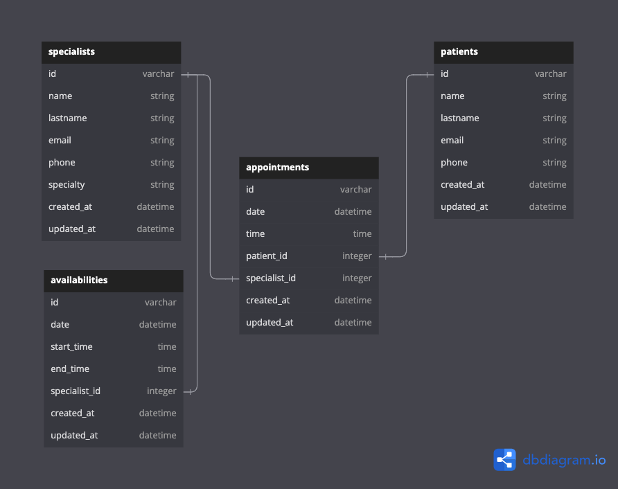

# Scheduler API
Challeng Scheduler API

#### Using:
* Ruby: ruby-3.1.5
* Rails: 7.1.3
* Database: SQLite3

## Installation (MacOS):
##### Pre requisites
1. Install [Colima Runtime](https://github.com/abiosoft/colima "Colima Runtime")
2. Install [Docker Client](https://docs.docker.com/engine/install/)
##### Setup
1. Clone the repo
```bash
git clone https://github.com/danife8/scheduler_api.git
```
2. Move to the project folder
```bash
cd scheduler_api
```
3. Start colima runtime
```bash
colima start
```
4. Build the docker image
```bash
docker build -t scheduler_api .
```
5. Run the docker image in a volume
```bash
docker run -p 3000:3000 -v $(pwd):/rails -it scheduler_api
```
Done!

## Database design


## Postman endpoints collection
How to import endpoints collection in Postman. [Here](https://learning.postman.com/docs/getting-started/importing-and-exporting/importing-data/#import-postman-data)

Endpoints collection. [Here](vendor/scheduler_api.postman_collection.json)
## Tools
First we need docker container id with
```bash 
docker ps --filter "ancestor=scheduler_api:latest" --format "{{.ID}}"
```
##### Run test suite
```bash
docker exec -it <container_id> rspec .
```
##### Run Linter
```bash
docker exec -it <container_id> rubocop .
```
## Notes
I took a lot of limitations for this project before making over-engineering or get drown in a brainstorm of features.
I can find a lot of edge cases that are needed to cover but also a lot of suggestions to make it a full system.

This project was created with the `--api` flag in `rails new ...` command to have just the necessary for our purposes. This app is using the versioning system `Api::V1` so the models were created with `rails g model` and the endopoints with `rails g scaffold api/v1/.... attributes:datatype --model_name="..."` to make it pretty straight forward.

All requests were forced to act as JSON in the routes.
